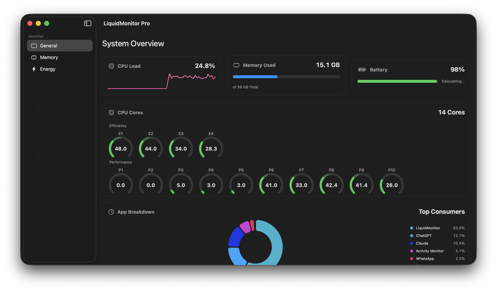

# LiquidMonitor

> [!WARNING]
> **PRE-ALPHA SOFTWARE / ACTIVE DEVELOPMENT**
> This application is currently in an early stage of development. It is **unstable**, **incomplete**, and subject to breaking changes without notice. Use at your own risk.

**LiquidMonitor** is a specialized monitoring tool designed for macOS.

## ⚠️ Hardware Compatibility & Restrictions

**Crucial Notice:** This software is explicitly developed and optimized for:

* **Device:** MacBook Pro / Air (Apple Silicon)
* **Chipset:** **Apple M3** Series (M3, M3 Pro, M3 Max)

Support for other architectures (Intel, M1, M2) or other hardware configurations is **not guaranteed** and is not a priority at this stage. The application relies on specific hardware sensors and metrics available on the M3 platform.

## 🛠 Project Status

* **Status:** 🚧 In Development
* **Stability:** Unstable
* **Current Version:** 0.0.1 (Experimental)

This project is a personal utility open-sourced for educational and transparency purposes. Features may be partially implemented or broken.

## 📄 License

**PolyForm Noncommercial License 1.0.0**

This project is licensed under the **PolyForm Noncommercial License 1.0.0**.

* ✅ **Allowed:** You are free to read, modify, and run this software for **personal, non-commercial use**.
* ❌ **Prohibited:** Any commercial use (selling the software, using it for commercial services, etc.) is strictly prohibited without my explicit permission.

See [LICENSE.md](LICENSE.md) for the full license text.

## 🌐 Community

Join us on [Discord : https://discord.gg/2Akw3qdB5F](https://discord.gg/2Akw3qdB5F)

## Copyright

Copyright © 2026 Shayn. All rights reserved.
